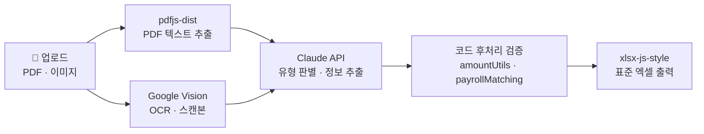

# 증빙 표준화 AI - README

## 개요 (Overview)
회계 증빙(PDF·이미지)을 표준화된 엑셀로 일괄 변환하는 툴이다.
파일을 하나씩 열어보는 대신, 인덱스가 매겨진 엑셀 한 권에서 수십 건의
서로 다른 증빙을 한눈에 검증할 수 있게 한다.

## 해결하려는 문제 (Core Problem)
- **단순 반복 대조** — 거래 하나를 검증하려면 이체증·세금계산서·거래명세서를
  따로 받아 금액과 거래처명을 일일이 눈으로 맞춰야 함
- **제각각인 형식** — 증빙마다 레이아웃·페이지 수·스캔 품질이 모두 다름
- **필수지만 느린 작업** — 증빙 확인은 생략 불가한 기본 절차인데,
  20여 개 소기업을 담당하다 보니 결산기마다 업무를 지배함

## 해결 구조 (Solution Architecture)
숫자 무결성을 위해 역할을 엄격히 분리한다:

> "AI는 문맥과 필드를 추출 ↔ 코드가 모든 숫자를 검증·변환·교차대조"

급여는 3자 대사로 검증한다:

> "급여대장(실지급액) ↔ 이체 총액 ↔ 원천징수신고서(총지급액)"

핵심 기능:
- **문서 유형 자동 판별** — 8개 증빙 유형을 Claude가 스스로 인식
- **PDF 텍스트 추출 + OCR 폴백** — 텍스트 PDF는 직접 추출(pdfjs-dist),
  스캔본은 Google Vision OCR로 처리
- **저화질 이미지 전처리** — 1.5MP + Laplacian 흐림 판별로 저화질만 골라
  canvas 2배 확대(토큰 경제성 고려)
- **한글 금액 교차검증** — 한글↔숫자를 코드가 재계산, 한글 기준 우선
- **급여 크로스체크** — 동명이인은 금액 기준으로 구분해 매칭
- **일괄 추출** — 고유 인덱스(No.)로 각 행을 원본과 연결한 엑셀 한 권으로 출력

## 아키텍처 (Architecture)

기술 스택 파이프라인 — 업로드부터 표준 엑셀 출력까지:

> 전 과정은 Next.js(App Router · TypeScript)로 구현되고 Vercel에 배포된다.
> AI(Claude·Google Vision)는 인식·추출만 담당하고, 숫자 검증은 코드가 전담한다.

## 기술 스택 (Technology Stack)
- **Next.js** (App Router + TypeScript) — 풀스택 개발
- **Claude API** (Anthropic) — 문서 유형 판별 및 정보 추출
- **Google Vision OCR** — 스캔 문서 텍스트 인식
- **pdfjs-dist** — 브라우저 내 PDF 텍스트 추출 및 이미지 렌더링
- **xlsx-js-style** — 스타일이 적용된 엑셀 생성
- **Vercel** — 배포 및 브랜치별 프리뷰 빌드
- **node:test** — 금액·급여 매칭 로직을 지키는 단위 테스트

## 보안 (Security Framework)
- **데이터 미저장** — 파일은 요청 시 메모리에서만 처리되고 서버에 저장하지 않음
- **최소 외부 전송** — 검증 대상 증빙만 추출/OCR API로 전송
- **숫자 무결성은 코드가 담당** — 금액은 결정적 코드가 재계산·검증하며
  AI 출력을 그대로 신뢰하지 않음
- **테스트로 회귀 방지** — 금액·급여 매칭 로직을 단위 테스트로 보호

**Live Demo:** https://pdf-excel-converter.vercel.app/
