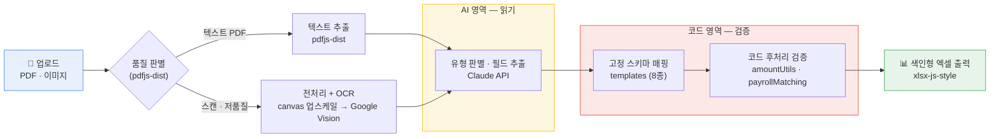

# 증빙 표준화 Tool

> 여러 유형의 회계증빙을 **유형별로 자동 판별·구조화**하여 **하나의 색인형 엑셀로 일괄 추출**하는 감사 보조 Tool입니다. 검토자는 파일을 한 건씩 열지 않고, 인덱스가 걸린 워크북에서 수십 건의 이질적 증빙을 한 화면에서 대조합니다.

**🔗 라이브 데모** · https://pdf-excel-converter-azure.vercel.app/

`Next.js` · `TypeScript` · `Claude API` · `Google Vision OCR` · `pdfjs-dist` · `xlsx-js-style` · `Vercel`

---

## Pain point
> **"비표준·대량 증빙의 수기 대조 — 절대 생략할 수 없는 증빙 확인"**

* **반복적 수기 검토** : 한 거래를 검증하려면 이체증·세금계산서·거래명세서 등 별개의 PDF를 눈으로 교차 대조해야 함
* **양식 파편화** : 증빙마다 레이아웃·페이지 수·스캔 품질이 제각각이라 일관된 처리가 불가
* **필수이나 느린 기초 작업** : 증빙 검토는 생략 불가능한 기초 단계로, 다수의 소규모 클라이언트를 다루는 마감 기간에 업무량이 집중적으로 증가

---

## 해결 방안 
> **"AI는 문맥과 필드를 추출, 코드는 모든 숫자를 변환·재계산·교차검증"**

* **문서 유형 자동 판별 (정형화)** : Claude가 8종 증빙 유형을 자동 분류하고, 유형별 고정 스키마에 맞춰 필드를 추출 → 이질적 증빙을 하나의 표준 구조로 수렴
* **AI-코드 역할 분리 (신뢰성)** : AI 출력을 그대로 신뢰하지 않고, 금액·합계는 코드가 재계산·검증. 한글 금액(한글↔숫자)은 코드가 다시 읽어 대조
* **급여 3자 대사 (교차 검증)** : `급여대장(실수령)` ↔ `이체 합계` ↔ `원천징수 신고(총지급)` 3단 대조로 정합성을 검증하고, 동명이인은 금액 기준으로 매칭

---

## 핵심 설계 원칙 — AI가 아니라 코드가 숫자를 책임진다

```
① AI 추출(유형 판별·필드 추출)  →  ② 코드 후처리(재계산·정규식·목록 대조)  →  ③ 엑셀 출력
      "문맥·항목을 읽는다"            "숫자를 다시 계산해 검증한다"         
```

-  AI가 읽은 값을 코드가 재계산·재검증하여, 모델 출력의 오류를 차단
- 검증된 값만 엑셀 각 행에 기록하고, `No.` 색인으로 원본 증빙 파악 가능
---

## 핵심 설계 원칙 ② — 가장 싼 경로부터, 실패할 때만 비싼 경로로
 
같은 증빙이라도 처리 방식마다 비용·정확도가 다릅니다. 그래서 **텍스트 → OCR → claude Vision** 순으로 두고, **앞 단계로 해결되면 뒤 단계는 거치지않도록** 설계했습니다.
 
```
[가장 저렴] 텍스트 레이어 추출   →  [중간] Google OCR   →  [가장 비쌈] AI Vision(이미지 전송)
   게이트 A: 텍스트 ≥50자        게이트 B: OCR >50자면        두 게이트를 모두 통과 못한
   종료 (OCR·Vision 생략)          종료 (Vision 생략)           경우에만 이미지로 폴백
```
 
- **게이트 A** — pdfjs로 뽑은 텍스트가 50자 이상이면 텍스트 PDF로 보고, 텍스트 추출
- **게이트 B** — OCR 결과가 50자 초과면 그 텍스트를 채택하고 AI Vision을 **건너뜀**
- **화질이 필요한 경우에만 보정** — 이미지가 1.5MP 미만이거나 Laplacian 선명도 점수 200 미만일 때만 2배 확대해 OCR 정확도를 확보(모든 이미지를 불필요하게 키우지 않음)
- **렌더 배율도 동적 계산** — PDF는 가장 긴 변 2,500px를 목표(scale ≈ 3)로 스케일을 계산하고 1.5~3.0 배로 제한해, OCR 품질과 메모리·전송량을 함께 관리
> 결과적으로 대부분의 증빙은 가장 싼 텍스트 경로에서 끝나고, 스캔·저화질 증빙만 상위 비용 단계로 넘어갑니다.
 
---

## 주요 기능

* **8종 증빙 유형 자동 판별**
  Claude가 문서 유형을 분류하고, 유형별 고정 스키마에 맞춰 필드를 추출합니다.

* **PDF 텍스트 추출 + OCR 폴백**
  `pdfjs-dist`로 브라우저 내에서 텍스트를 먼저 추출하고, 스캔·이미지 증빙은 Google Vision OCR로 우회 처리합니다.

* **저품질 이미지 전처리**
  1.5MP 미만 + Laplacian 흐림 판별 → 저품질로 분류된 이미지에 한해 canvas 2배 업스케일을 적용합니다(토큰 절약을 위해 선택적 적용).

* **한글 금액 교차 검증**
  한글 금액과 숫자 금액을 코드가 다시 읽어 대조하며, 판독 시 한글 표기를 우선합니다.

* **급여 3자 크로스체크**
  급여대장·이체·원천징수를 대조하고, 동명이인은 금액 기준으로 구분합니다.

* **색인형 엑셀 일괄 추출**
  전체 증빙을 하나의 워크북으로 추출하고, `No.` 인덱스가 각 행을 원본 증빙과 연결합니다.

---

## 기술 스택 · 파이프라인




| 기술 | 선택 이유 |
|---|---|
| **Next.js** (App Router, TypeScript) | 브라우저에서 PDF를 먼저 파싱(`pdfjs`)해 **전송량을 줄이는 처리**와, 서버 라우트에서 **API 키를 숨긴 채 AI를 호출**하는 처리가 한 프로젝트에 공존해야 했음 → 클라이언트·서버 처리를 함께 다룰 수 있는 풀스택 구조 |
| **Claude API** (Anthropic) | 형식이 제각각인 **증빙 8종의 유형 판별과 표준 양식의 필드 추출**이 핵심 → 긴 문맥의 문서 이해에 활용 (**출력을 그대로 신뢰하지 않고** 숫자는 코드가 재계산) |
| **Google Vision OCR** | 텍스트 추출이 불가능한 스캔본,이미지만 따로 처리하는 OCR|
| **pdfjs-dist** | 텍스트 PDF는 서버로 보내기 전 **브라우저에서 직접 추출** → **외부 API 전송량과 OCR 호출 비용**을 동시에 절감 |
| **xlsx-js-style** | 서식 지정이나 시트 분리가 불가능한 단순 CSV 대신, 셀 배경색·테두리·폰트 스타일링이 가능한 xlsx-js-style 라이브러리를 도입 **최종 산출물을 보기좋게 시각화함** |
| **Vercel** | AI 프롬프트와 OCR 전처리 로직은 작은 수정에도 결과물이 크게 달라져, 실제 증빙 샘플을 통한 끊임없는 테스트와 결과 대조가 필요(**Preview test 수행**) |

---

## 보안 · 통제

증빙에 담긴 회계 데이터의 특성을 고려해, **저장하지 않고, 최소한만 전송하며, 숫자는 코드가 검증**하는 원칙으로 설계했습니다.

* **외부 전송 최소화** : 검토 대상 증빙만 추출·OCR API로 전송하며, 그 외 데이터는 외부로 나가지 않습니다.
* **코드 소유의 숫자 무결성** : 금액은 결정론적 코드가 재계산·검증하며, AI 출력을 직접 신뢰하지 않습니다.
* **테스트로 보호되는 회귀 방지** : 금액·급여 매칭 로직을 단위 테스트로 보호합니다.

---

